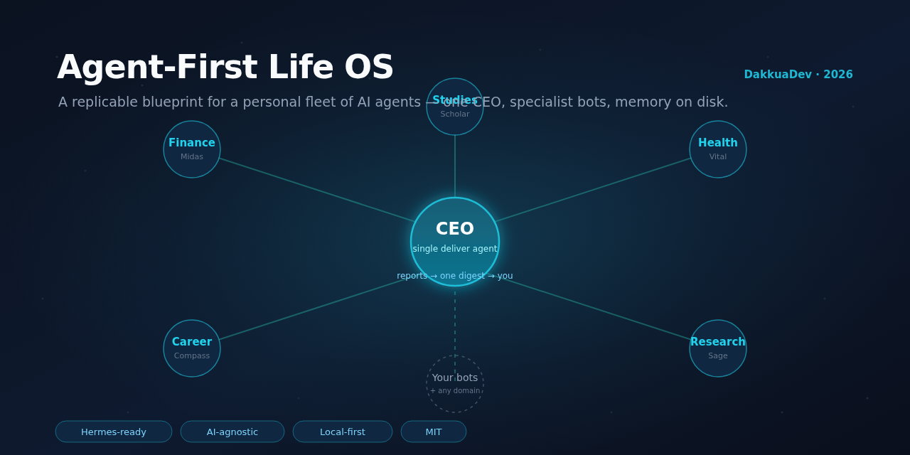

# Agent-First Life OS

<p align="center">
  
</p>

A **minimal, replicable blueprint** for a personal "operating system" built around a fleet of
specialist AI agents, orchestrated by a single **CEO agent** that makes the decisions and is the
**only agent that talks to you** — everything else reports to it. **Your fleet, your modules,
your deployment**: the pattern stays the same, the configuration is yours.

Built and tested with [Hermes Agent](https://hermes-agent.nousresearch.com) (works with any agent
that can read `AGENTS.md` — Claude Code, Codex, OpenCode, Gemini CLI, …). Inspired by the
[Harness Engineering](https://github.com/betta-tech/ejemplo-harness-subagentes) pattern:
**the repo IS the system**, state lives on disk (not in chat), verification is executable.

> ⚠️ **Sanitized for sharing.** Replace `{{OWNER_NAME}}`, `{{OWNER_EMAIL}}` and any personal IDs
> (Sheets, Notion, channels) with your own. Never commit secrets or tokens — they belong in
> `.env` files that this repo never touches.

## One pattern, three deployments

| Profile | Where it runs | Best for | Cost |
|---|---|---|---|
| **Local-only** | Laptop/desktop, local models (Ollama) | Client / private / single machine | €0 |
| **Cloud VPS** | Hosted Hermes instance, always-on | Someone who needs 24/7 (e.g. a partner) | ~$0–17/mo |
| **Hybrid** | Cloud CEO (front door) + local workers | Power user who wants both | €0 + cheap cloud |

**Everything is optional per person** — vault (Obsidian memory layer), Composio (tool bridge),
chat gateway (Discord/WhatsApp), extra bots. Pick a profile in
[`docs/deployment.md`](docs/deployment.md), then follow [`docs/setup.md`](docs/setup.md).

## The pattern in one picture

```
                ┌──────────────────────────────────────┐
                │  CLOUD (front door, always-on)       │
                │  CEO bot — orchestrator + SINGLE     │
                │  deliver agent (Discord / WhatsApp)  │
                └───────────────┬──────────────────────┘
                                │ messages in (chat)
                                │ peer bridge / API
                ┌───────────────▼──────────────────────┐
                │  LOCAL (brain, open-source models)   │
                │  CEO (orchestrator) ← talks to you   │
                │  ├── finance  · career  · health    │
                │  └── research                       │
                │  Obsidian vault (memory layer)       │
                └──────────────────────────────────────┘
```

**Rules that make it work:**
1. **One deliver agent.** All fleet and cron reports flow to CEO. CEO synthesizes → posts ONE
   digest. No raw output reaches you unprocessed.
2. **Local-first, cloud as rescue.** Open-source models (Ollama) for daily work; a paid/frontier
   model only when a task genuinely needs it — and only on explicit request.
3. **Minimum viable bot.** A new agent exists only when a domain has recurring, distinct work a
   skill or cron can't cover. Prefer skill > cron > new bot.
4. **State on disk.** The vault (or any markdown store) is the memory layer; `progress/` is the
   audit trail. Context windows die; files don't.
5. **Executable verification.** `scripts/verify.sh` checks the system is healthy. Don't trust the
   agent's self-report.

## Quickstart

1. Clone this repo.
2. **Run the installer:** `python3 scripts/setup.py` — it asks you your **deployment profile**
   (local / cloud / hybrid), who you are, which agents you want (+ custom bots), nicknames +
   handles, model/provider (defaults follow the profile), personality, **whether you want the
   vault / Composio / a chat gateway** (each optional). It renders your fleet:
   - `lifeos.config.json` (your answers — `verify.sh` reads it)
   - `generated/agents/<handle>.md` (one ready-to-install SOUL per bot)
   - `generated/SETUP-NEXT-STEPS.md` (exact commands for YOUR profile + modules)
3. Copy `.env.example` → `.env` and fill only the tokens you chose (Discord/WhatsApp, Composio, sheets/Notion…).
4. `./scripts/verify.sh` — must end green (it adapts to your config).
5. Read `AGENTS.md` — it tells any agent how to run this system.
6. Talk to CEO. Delegate. Watch it manage the fleet.

> **Nicknames:** every bot has a display name (e.g. CEO = *Aegis*, finance = *Midas*) plus a
> functional handle (e.g. `ceo-bot`, `finances-bot`). Handles stay searchable and taggable;
> nicknames give them personality. Change them anytime in the installer or the config.

## Structure

```
├── assets/                # banner (svg + png) for README / social
├── AGENTS.md              # Map for any AI agent (progressive disclosure)
├── CHECKPOINTS.md         # "Correct final state" criteria per domain
├── README.md              # this file
├── LICENSE                # MIT
├── agents/                # SOUL templates per role (the fleet's identity)
│   ├── ceo-bot.md         #   orchestrator + single deliver agent
│   ├── finances-bot.md    #   personal finance (Midas)
│   ├── career-bot.md      #   career & job hunting (Compass)
│   ├── health-bot.md      #   health / exercise / diet (Vital)
│   ├── research-bot.md    #   deep research (Sage)
│   ├── studies-bot.md     #   academic study (Scholar)
│   └── custom-bot.md      #   template for YOUR own domains (kids, home, …)
├── profiles/              # (optional) per-bot: config + skill manifest
├── skills/                # (optional) portable procedural skills shared by the fleet
├── scripts/               # setup.py (installer), verify.sh (health), no_agent crons
├── docs/
│   ├── architecture.md    # the full diagram + delivery model
│   ├── memory-layer.md    # the vault: role, contract, and why it's a SEPARATE repo
│   ├── conventions.md     # vault rules, model posture, naming
│   ├── verification.md    # how to prove the system works
│   ├── setup.md           # new-instance bootstrap guide (~1h to working system)
│   ├── integrations.md    # Composio MCP + Discord + Google + Notion + GitHub connections
│   ├── daily-use.md       # daily cron rhythm, how to talk to CEO, weekly maintenance
│   ├── deployment.md      # three profiles (local / cloud / hybrid) + backup/restore
│   └── principles.md      # the 'why' — researched best practices behind the architecture
├── templates/             # new-agent bootstrap checklist (SOUL + skills + routine)
└── progress/              # history.md (append-only log)
```

## Replicating for anyone

This repo is a **template, not a snapshot**: fork it per person, replace the placeholders,
adjust the fleet to their life (add a `kids` bot, drop `research-bot`), pick their deployment
profile and modules — the plumbing stays identical. The plumbing — CEO delivery protocol,
verification, memory rules — is the part worth keeping. Guidance per profile: `docs/deployment.md`.
